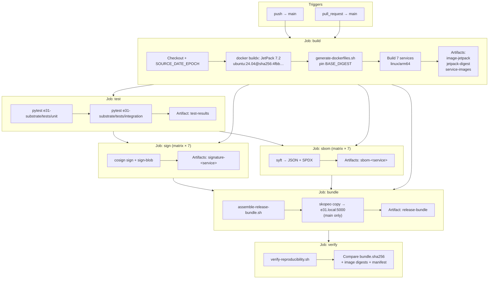

# E31 Substrate CI/CD Pipeline Overview

**Document type:** Accreditation runbook  
**Audience:** Build engineers, release managers, assessors  
**Workflow source of truth:** [`.github/workflows/ci.yml`](../../.github/workflows/ci.yml)  
**Related:** [signing.md](signing.md) · [verification-checklist.md](verification-checklist.md) · [release-notes-template.md](release-notes-template.md) · [Air-gap provisioning](../runbooks/airgap-provisioning.md)

---

## Purpose

The E31 Substrate CI/CD pipeline produces a **reproducible, Cosign-signed, content-addressed OCI release bundle** that can provision a sealed Jetson AGX Thor appliance (*E31 Czar*) with zero outbound network access after transfer.

It:

1. Builds the **JetPack 7.2** base image (Ubuntu 24.04, L4T r38.2.0–compatible) with a **pinned Ubuntu digest**.
2. Compiles and containerizes all **seven** substrate services (Memory, Retrieval, Inference, Fine-Tuning, Eval, Watchman, Local Bridge) for `linux/arm64`.
3. Runs **unit** and **integration** tests against the FastAPI service contracts.
4. **Signs** every service image with Cosign and generates **Syft SBOMs** (JSON + SPDX).
5. Assembles an **OCI release archive** containing images, model catalog assets, Helm charts, lockfiles, and runbooks.
6. **Verifies bit-for-bit reproducibility** by re-assembling the bundle on a clean runner and comparing digests.

Identical inputs (`SOURCE_DATE_EPOCH`, pinned base digest, same source tree) must yield identical `bundle.sha256` and image content digests on repeated runs.

---

## Artifact flow (build → release bundle)

```text
Source tree (git SHA)
        │
        ▼
┌───────────────────┐
│  build            │  JetPack 7.2 base + 7 service image tarballs
│                   │  Outputs: image-jetpack, jetpack-digest, service-images
└─────────┬─────────┘
          │
          ▼
┌───────────────────┐
│  test             │  pytest unit + integration
│                   │  Outputs: test-results (JUnit XML)
└─────────┬─────────┘
          │
     ┌────┴────┐
     ▼         ▼
┌─────────┐ ┌─────────┐
│  sign   │ │  sbom   │  Cosign signatures / Syft SBOMs (per service)
└────┬────┘ └────┬────┘
     │           │
     └─────┬─────┘
           ▼
┌───────────────────┐
│  bundle           │  assemble-release-bundle.sh → e31-release-<ver>.tar
│                   │  + manifest.sha256 (+ .sig) + bundle.sha256
└─────────┬─────────┘
          │
          ▼
┌───────────────────┐
│  verify           │  Clean-runner re-assembly; fail on digest mismatch
└───────────────────┘
          │
          ▼
   Air-gap media → sealed appliance (see airgap-provisioning.md)
```

---

## Pipeline diagram



---

## Workflow jobs — inputs and outputs

| Job | Needs | Key inputs | Key outputs / artifacts |
|-----|-------|------------|-------------------------|
| **build** | — | Repo checkout; `PLATFORM=linux/arm64`; `REGISTRY=e31.local:5000`; `IMAGE_TAG=${{ github.sha }}`; pinned Ubuntu digest in `Dockerfile.base` | Job outputs: `jetpack_digest`, `bundle_version`, `source_date_epoch`. Artifacts: `image-jetpack`, `jetpack-digest`, `service-images` |
| **test** | `build` | Checkout; Python 3.12; `PYTHONPATH` spanning all seven `*/docker/src` trees | Artifact: `test-results` (`unit.xml`, `integration.xml`) |
| **sign** | `build`, `test` | Service image tarballs; secrets `COSIGN_KEY`, `COSIGN_PASSWORD` (optional ephemeral key if unset) | Artifacts: `signature-<service>/` (`image.digest`, `image.sig`, optional `cosign.pub`) |
| **sbom** | `build`, `test` | Service image tarballs; Syft CLI | Artifacts: `sbom-<service>/` (`sbom-<service>.json`, `sbom-<service>.spdx.json`) |
| **bundle** | `build`, `sign`, `sbom` | Images + signatures + SBOMs; `assemble-release-bundle.sh`; Cosign key | Artifacts: `e31-release-*.tar`, `manifest.sha256`, `manifest.sha256.sig`, `bundle.sha256`, `bundle-info.json`, `bundle/meta/`. Job outputs: `tar_sha256`, `version`, `epoch` |
| **verify** | `bundle` | Reference release-bundle artifact; same images + `SOURCE_DATE_EPOCH` / version | Artifact: `reproducibility-report`; job **fails** on digest mismatch |

**Triggers:** `push` to `main`, `pull_request` targeting `main`.  
**Concurrency:** workflow group `e31-substrate-ci-<workflow>-<ref>`; each job has its own cancel-in-progress group.  
**Artifact retention:** 14 days.

---

## Build and test jobs (step-by-step)

### Required secrets and environment

| Name | Required | Purpose |
|------|----------|---------|
| `COSIGN_KEY` | Yes (production) | Cosign private key (PEM text or base64-encoded PEM). Used by `sign` and `bundle` for image/manifest signatures. |
| `REGISTRY_TOKEN` | Yes (registry publish) | Bearer/token credential for authenticating pushes to the internal OCI registry (`e31.local:5000` or `E31_REGISTRY` override). Store as a GitHub Actions secret; inject via `docker login` / `skopeo login` before publish steps. |
| `COSIGN_PASSWORD` | If key is encrypted | Passphrase for the Cosign private key. |
| `E31_REGISTRY` | Optional variable | Overrides default registry `e31.local:5000`. |

Workflow-level environment (non-secret):

| Variable | Default | Purpose |
|----------|---------|---------|
| `REGISTRY` | `e31.local:5000` | Image registry hostname |
| `IMAGE_TAG` | `${{ github.sha }}` | Per-commit image tag |
| `PLATFORM` | `linux/arm64` | Target architecture (Jetson AGX Thor) |
| `SOURCE_DATE_EPOCH` | `git log -1 --format=%ct` | Deterministic timestamps for tar/metadata |
| `ARTIFACT_RETENTION_DAYS` | `14` | GitHub Actions artifact TTL |

If `COSIGN_KEY` is unset in CI, the workflow generates an **ephemeral** keypair so signing paths are exercised. Ephemeral keys are **not** a production trust root.

### Build — JetPack 7.2 base with pinned digest

The base image `FROM` line pins Ubuntu 24.04 by digest (`UBUNTU_DIGEST` in `e31-substrate/docker/Dockerfile.base`):

```dockerfile
ARG UBUNTU_DIGEST=sha256:4fbb8e6a8395de5a7550b33509421a2bafbc0aab6c06ba2cef9ebffbc7092d90
FROM ubuntu:24.04@sha256:4fbb8e6a8395de5a7550b33509421a2bafbc0aab6c06ba2cef9ebffbc7092d90
```

**Docker build command (CI / local equivalent):**

```bash
# Pinned base image digest (Ubuntu 24.04) — do not float on :latest
export PLATFORM=linux/arm64
export REGISTRY=e31.local:5000

docker buildx build \
  --platform "${PLATFORM}" \
  -f e31-substrate/docker/Dockerfile.base \
  -t "${REGISTRY}/jetpack:7.2" \
  --load \
  e31-substrate/docker

# Capture and pin the resulting JetPack image digest for all service builds
docker inspect --format='{{.Id}}' "${REGISTRY}/jetpack:7.2" \
  | sed 's/^sha256://' \
  | awk '{print "sha256:"$1}' \
  | tee e31-substrate/docker/.jetpack-digest
```

Or use the wrapper script (also signs/SBOMs when tools and `COSIGN_KEY` are present):

```bash
./e31-substrate/scripts/build-services.sh
```

### Build — seven substrate services

Service matrix is defined in `e31-substrate/docker/services.env` (`name|module|port|context`). After the base digest is written, generate per-service Dockerfiles and build:

```bash
export BASE_DIGEST="$(cat e31-substrate/docker/.jetpack-digest)"
export BASE_IMAGE="${REGISTRY}/jetpack:7.2"
bash e31-substrate/docker/generate-dockerfiles.sh

# Example: Memory service (repeat for each row in services.env)
docker buildx build \
  --platform linux/arm64 \
  --pull=false \
  --build-arg "BASE_IMAGE=${REGISTRY}/jetpack:7.2" \
  --build-arg "BASE_DIGEST=${BASE_DIGEST}" \
  --build-arg "SERVICE_NAME=memory" \
  --build-arg "SERVICE_MODULE=memory.main" \
  --build-arg "SERVICE_PORT=8080" \
  -f e31-substrate/memory/docker/Dockerfile \
  -t "${REGISTRY}/memory:${IMAGE_TAG:-v1}" \
  -t "${REGISTRY}/memory:v1" \
  --load \
  e31-substrate/memory/docker
```

CI saves each image as a gzipped tarball under `/tmp/service-images/<name>.tar.gz` and uploads the `service-images` artifact for downstream jobs.

### Test — discovery and execution

**Discovery:** pytest collects tests under:

| Suite | Path | Discovery rule |
|-------|------|----------------|
| Unit | `e31-substrate/tests/unit/` | Files matching `test_*.py`; functions `test_*` |
| Integration | `e31-substrate/tests/integration/` | Same pytest conventions |

Unit tests parametrize all seven FastAPI apps (e.g. `test_health.py` imports each `*.main` module and hits `/health`). Integration tests cover cross-service contracts in `test_service_contracts.py`.

**`PYTHONPATH`:** CI prepends every service `src` tree so imports resolve without installing packages:

```text
e31-substrate/memory/docker/src
e31-substrate/retrieval/docker/src
e31-substrate/inference/docker/src
e31-substrate/fine-tuning/docker/src
e31-substrate/eval/docker/src
e31-substrate/watchman/docker/src
e31-substrate/local-bridge/docker/src
```

**Invocation (matches CI):**

```bash
python -m pip install --upgrade pip
pip install pytest pytest-asyncio httpx fastapi uvicorn pydantic

export PYTHONPATH="e31-substrate/memory/docker/src:e31-substrate/retrieval/docker/src:e31-substrate/inference/docker/src:e31-substrate/fine-tuning/docker/src:e31-substrate/eval/docker/src:e31-substrate/watchman/docker/src:e31-substrate/local-bridge/docker/src"

pytest e31-substrate/tests/unit -v --junitxml=test-results/unit.xml
pytest e31-substrate/tests/integration -v --junitxml=test-results/integration.xml
```

Tests must pass before `sign` / `sbom` / `bundle` proceed (`needs: [build, test]` on signing and SBOM jobs).

---

## Local reproduction (full path)

```bash
# 1. Build base + services
export COSIGN_KEY=/path/to/cosign.key   # production key
export REGISTRY_TOKEN=***               # if pushing to registry
./e31-substrate/scripts/build-services.sh

# 2. Tests
export PYTHONPATH="e31-substrate/memory/docker/src:e31-substrate/retrieval/docker/src:e31-substrate/inference/docker/src:e31-substrate/fine-tuning/docker/src:e31-substrate/eval/docker/src:e31-substrate/watchman/docker/src:e31-substrate/local-bridge/docker/src"
pytest e31-substrate/tests/unit e31-substrate/tests/integration -v

# 3. Assemble + verify (see signing.md)
export SOURCE_DATE_EPOCH="$(git log -1 --format=%ct)"
./e31-substrate/scripts/assemble-release-bundle.sh \
  --registry e31.local:5000 --tag v1 --version "$(git rev-parse --short=12 HEAD)" \
  --out dist/release-bundle --cosign-key "${COSIGN_KEY}" --skip-clone

./e31-substrate/scripts/verify-reproducibility.sh \
  --reference dist/release-bundle --out dist/verify-bundle \
  --version "$(git rev-parse --short=12 HEAD)" --cosign-key "${COSIGN_KEY}"
```

---

## Publication

Documentation set published to the internal portal:

| Field | Value |
|-------|-------|
| **Portal URL** | https://docs.internal.e31.local/ci-cd/overview |
| **Publish command** | `DOCS_TARGET=internal-portal ./scripts/publish-docs.sh` |
| **Published at (UTC)** | 2026-07-10T21:42:54Z |
| **Publish receipt** | `docs/portal-preview/.publish-receipt.json` |
| **Local preview** | `docs/portal-preview/ci-cd/index.html` (formatting and links verified by publish script) |

See the [verification checklist](verification-checklist.md) for acceptance criteria alignment and the [release notes template](release-notes-template.md) for per-release digest capture.
